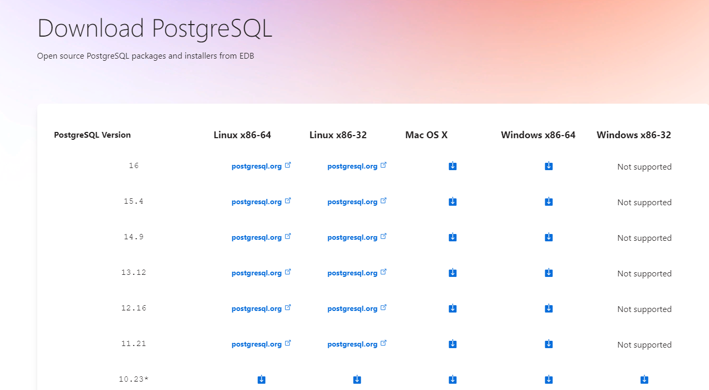
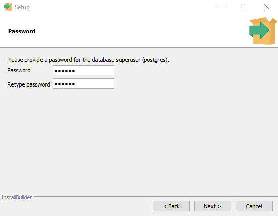
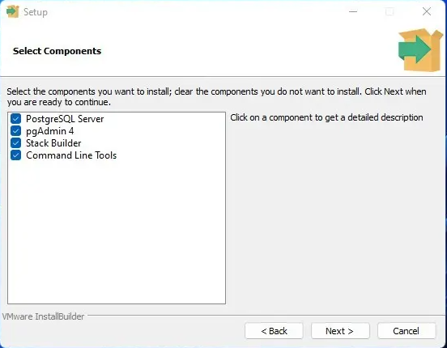
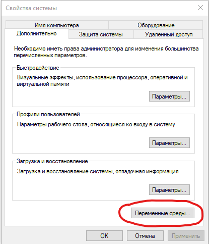
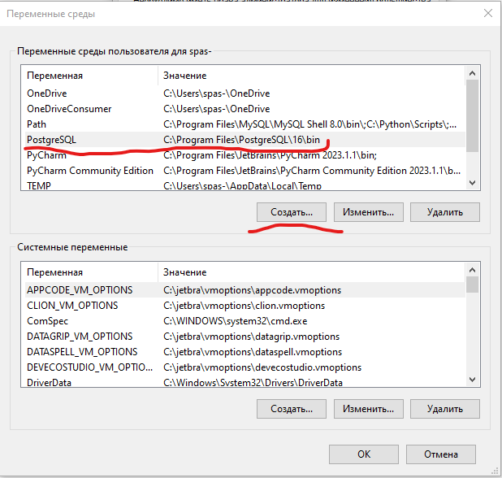
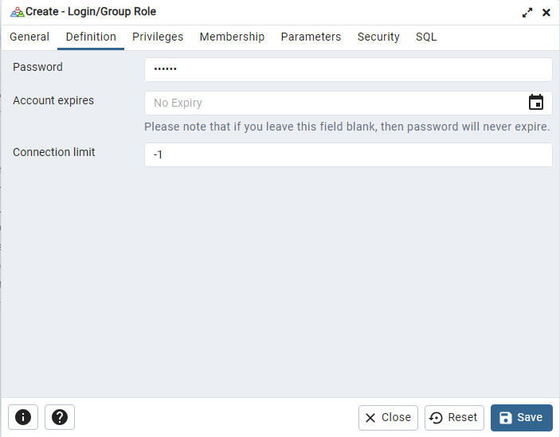
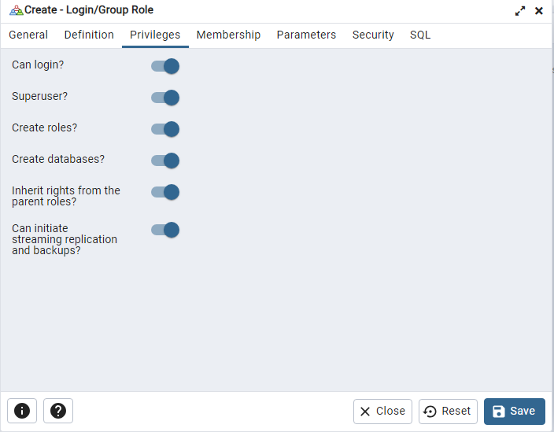
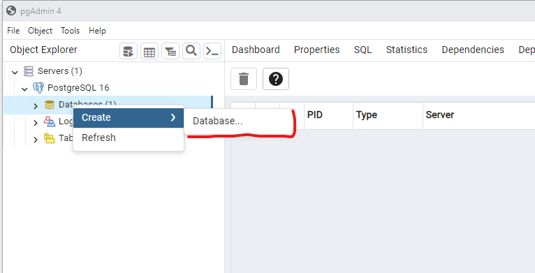

## Руководство пользователя

<hr>

## Подготовка проекта


* В консоли, перейдите к проекту и установите виртуальное окружение командой
```html
    python -m venv (your_name_env)
```
    - Структура проекта
    ```python
        Work_dir
          |____megano
            |___authorization
            |___cart
            |___compare
            |___import
            |___store
            |___services
            |___static
            |___templates
            |___megano
          |____my_venv
          |____.gitignore
          |____README.md

    ```


* После установки активируйте виртуальное окружение
    - <b>в Windows</b>
    ```html
        venv\Scripts\activate
    ```
    - <b>в UNIX system</b>
    ```html
        source (your_name_env)/bin/activate
    ```
    
* Установите все зависимости для запуска проекта
```html
    pip install -r requirements.txt
```
* Что бы посмотреть какие зависимости установлены, поможет команда
```html
    pip freeze
```

* <b>Проект готов к запуску</b>

<b>[↑ Содержание](#содержание)</b>

## Установка и настройка переменных окружения

Воспользуемся пакетом <u>[python-dotenv](#https://github.com/theskumar/python-dotenv)</u>. Он позволяет загружать переменные окружения из файла ***<u>.env</u>*** в корневом каталоге приложения.
Устанавливаем пакет:

```html
pip install python-dotenv
```
Теперь можно создать файл .env со всеми переменными среды, которые необходимы вашему приложению. 

<hr>

 ВАЖНО!
Назначение файла <u>.env</u> заключается в том, чтобы вынести конфиденциальные данные за пределы вашего проекта. Поэтому следует добавить <u>.env-файл</u> в <u>.gitignore</u>, что бы не хранить его в системе контроля версий.
<hr>

* Пример содержания файла <u>.env</u>
    ```python
    API_KEY='very_secret_password'
    SECRET_KEY='your_secret_key'
    TOKEN='token'
    ```
* В <u>settings.py</u> импортируем библиотеку и настраиваем переменные
    
    ```python
    import os
    from dotenv import load_dotenv
    
    # поиск файла .env и загрузки из него переменных среды
    load_dotenv()

    # сохраняем в переменные значения из словаря по ключу
    DEBUG = True if os.getenv('DEBUG') == "True" else False
    SECRET_KEY = os.getenv('SECRET_KEY')
    ALLOWED_HOSTS = os.getenv('ALLOWED_HOSTS').split(',')
    DATABASES = {
        'default': {
            'ENGINE': os.getenv('DB_ENGINE_SQLITE'),
            'NAME': BASE_DIR / os.getenv('DB_NAME_SQLITE'),
        } if DEBUG else { # если DEBUG=True, то устанавливается база sqlite3 
            'ENGINE': os.getenv('DB_ENGINE'),
            'NAME': os.getenv('DB_NAME'),
            'USER': os.getenv('DB_USER'),
            'PASSWORD': os.getenv('DB_PASSWORD'),
            'HOST': os.getenv('DB_HOST'),
        }
    }
    ```
<b>[↑ Содержание](#содержание)</b>

## Установка PostrgreSQL
* [Windows](#установка-и-создание-бд-в-windows)
* [Linux](#установка-и-создание-бд-в-linux)
* [Mac OS](#установка-в-mac-os)

* Для установки перейдите на <u>[официальный сайт](https://www.enterprisedb.com/downloads/postgres-postgresql-downloads)</u> и загрузите установщик, скачивайте последнюю версию.

    

________

### Установка  и создание БД в Windows
* Запустите скачанный файл установщика. Все оставляем по умолчанию.
    -  По пути установите "мастер пароль" для сервера базы данных.
    - В поле "Stack Builder" (опционально) можно снять галочку.

    
    

* После завершения установки PostgreSQL вы можете использовать его для создания и управления базами данных, которые будут использоваться в вашем проекте Django.

* Добавляем путь в среду переменных Windows
    - <b>Открываем свойства Системы</b>

    

    - <b>Кликаем "Создать" в полях прописываем название перем енной и вставляем путь как на скрине</b>
    

* Открываем приложение <u>pgAdmin4</u>. В меню "Пуск - PostgreSQL - pgAdmin"
    - По умолчанию создается база данных "postghres" с пользователем "postgres"

    - <b>Создаем нашего пользователя</b>
    
    
    - <b>Устанавливаем пароль</b>
    
    
    - <b>Раздаем привелегии и сохраняем кнопкой <u>SAVE</u></b>
    

    - <b>Создаем базу данных</b>
    

    - <b>Вписываем имя БД, выбираем нашего пользователя и сохраняем кнопкой <u>SAVE</u></b>
    

    - <b>База данных создана и готова к использованию. Перехоидите к [Подключению базы к Django](#подключение-базы-к-django)</b>

<b>[↑ Содержание](#содержание)</b>

__________

### Установка и создание бд в Linux

* Установка компонентов из репозиториев Linux Ubuntu.
  Сначала обновим кэш менеджера пакетов с помощью apt:

```html
sudo apt update
```

* Затем установим Postgres и связанные с ним библиотеки:

```html
sudo apt install python3-pip python3-dev libpq-dev postgresql postgresql-contrib
```

* Во время установки Postgres в ОС был создан пользователь postgres, который соответствует пользователю postgres (администратору PostgreSQL). Этого пользователя необходимо использовать для выполнения административных задач. Перехоидим в консоль PostrgreSQL командой:

```html
sudo -i -u postgres psql
```

* Затем создадим базу данных для проекта Django. Также обращаем внимание на то, что важно не забывать заканчивать команды в командной строке SQL точкой с запятой — ; 

```html
CREATE DATABASE megano_db;
```

* Создадим пользователя базы данных и зададим пароль:

```html
CREATE USER megano WITH PASSWORD '123456';
```

* Установим кодировку по умолчанию на UTF-8:
```html
ALTER ROLE myproject_user SET client_encoding TO 'utf8';
```
* Затем установим схему изоляции транзакций по умолчанию на чтение с фиксацией, блокирующее чтение из незафиксированных транзакций:

```html
ALTER ROLE myproject_user SET default_transaction_isolation TO 'read committed';
```

* Установим часовой пояс. По умолчанию в проекте Django настроено использование UTC:

```html
ALTER ROLE myproject_user SET timezone TO 'UTC';
```

* И предоставим пользователю права доступа к созданной базе данных:

```html
GRANT ALL PRIVILEGES ON DATABASE myproject TO myproject_user;
```

Выход из командной строки SQL

```html
\q
```

<b>[↑ Содержание](#содержание)</b>
__________

### Установка в Mac OS

```html
# TODO Дописать инструкцию по установке БД под Mac OS
```

<b>[↑ Содержание](#содержание)</b>

## Подключение базы к Django

* После установки PostgreSQL необходимо настроить Django проект для связи с базой данных. Для этого нужно внести изменения в файл настроек проекта – settings.py. Откройте этот файл и найдите раздел DATABASES

    - ENGINE – указать, что используется база данных PostgreSQL;
    - NAME – имя базы данных, которую вы создали;
    - USER – имя пользователя базы данных;
    - PASSWORD – пароль пользователя;
    - HOST – адрес базы данных (обычно 127.0.0.1 для локальной базы данных);
    - PORT – порт на котором работает база данных (обычно 5432).

    ```python
        DATABASES	=	{
        ‘default’:	{
            ‘ENGINE’: ‘django.db.backends.postgresql’,	
            ‘NAME’: ‘mydatabase’,	
            ‘USER’: ‘mydatabaseuser’,	
            ‘PASSWORD’: ‘mypassword’,	
            ‘HOST’: ‘localhost’,	
            ‘PORT’: ‘5432’,	
            }	
        }
    ```

* Установка драйвера <b>psycorg2</b>

```html
    pip install psycopg2
    # альтернатива
    pip install psycopg2-binary
```
* После успешной установки psycopg2 его можно использовать в Django. Перед запуском миграций создайте [переменные окружения](#установка-и-настройка-переменных-окружения)

* Применяем миграции 
    * Перейдите в "progect_name" и воспользуйтесь командой
    - Структура проекта:

        ```python
        Work_dir
          |____progect_name
          |      |_____progect_name
          |      |_____manage.py
          |____my_venv
          |____.gitignore
          |____README.md
        ```

    ```html
        pip manage.py makemigrations
        pip manage.py migrate
    ```

## Установка и подключение Celery и Redis

Начните установку с Redis. Перейдите по следующей ссылке на [официальный сайт](https://redis.io/docs/install/install-redis/) и выберите установку, соответствующую вашей системе.

<hr>

 ВАЖНО!
Не забудьте запустить Redis
<hr>

Далее установите Celery командой
```
pip install celery
```

В файле .env пропишите константы:
  - REDIS_NAME – номер базы данных для Celery;
  - REDIS_HOST – адрес Redis;
  - REDIS_PORT – порт Redis.

Стандартные настройки:
```
REDIS_HOST=localhost
REDIS_PORT=6379
REDIS_NAME=0
```

В проекте реализованы две очереди задач: на оплату и на импорт json-файлов.

Команда для запуска очереди оплаты
```
 celery -A megano worker -l info -Q payment 
```

Команда для запуска очереди импорта
```
celery -A megano worker -l info -Q json_import
```

Запустить сразу оба воркера
```
celery -A megano worker -l info -Q payment,json_import -c 1
```

## Настройка отправки сообщений в консоль

Сообщения администратору отправляются автоматически после проведения успешного/неуспешного импорта.
Для этого используется модуль <b>django.core.mail</b>.

В файле .env пропишите константы:
- EMAIL_HOST – хост для отправки электронной почты;
- EMAIL_PORT – порт для отправки электронной почты;
- EMAIL_HOST_USER – username пользователя для прохождения аутентификации на SMTP-сервере; 
- EMAIL_HOST_PASSWORD – пароль к указанному username;
- DEFAULT_FROM_EMAIL – email, от кого будет отправка сообщений по умолчанию;
- EMAIL_BACKEND – django.core.mail.backends.console.EmailBackend


<b>[↑ Содержание](#содержание)</b>
